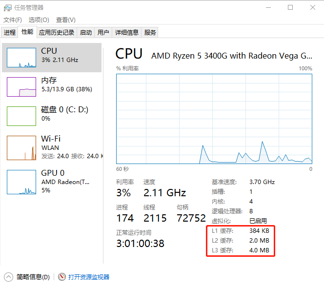

> LRU(Least Recently Used)最近最少使用的缓存
>
> 对操作系统来说，一些经常访问的数据可以放入缓存来提高程序的执行效率，读定速度越高，成本越高，因此需要一个策略来决定缓存中放入哪些数据，LRU的思想是记录最近访问过的数据，当缓存满的时候，将访问频率最低的丢弃掉
>
> 本篇文章记录一下这个缓存的简易实现
>
> 

### 一、数据结构

​		**哈希表**	一个存取复杂度几乎为O(1)的数据结构

​		**双链表**	维护访问顺序的双链表

### 二、实现

​		简单定义一下缓存的接口，放入数据，读取数据

```java
package com.qgyyohj.lru;

public interface Cache<K, V> {

    V get(K key);

    void set(K key, V value);
}
```

​		LRUCache实现，构造函数需要提供一个缓存的大小，初使化双链表


```java
public class LRUCache<K, V> implements Cache<K, V> {
    
    private final Map<K, Node<K, V>> CACHE;
    private final Node<K, V> HEAD;
    private final Node<K, V> TAIL;
    private final int CAPACITY;
    private int size;
    
	// 静态内部类，数据的存储载体，同时是双链表的一个结点
    private static class Node<K, V> {
    	Node<K, V> before;
    	Node<K, V> after;
    	K key;
    	V val;
	}
    
    public LRUCache(int capacity) {
        this.CAPACITY = capacity;
        CACHE = new HashMap<>(CAPACITY);
        size = 0;

        HEAD = new Node<>();
        TAIL = new Node<>();
        HEAD.after = TAIL;
        TAIL.before = HEAD;
    }
}
```

​		当一个结点被加入缓存或者被访问后，将这个结点放到链表的末尾，这样，头指针指向的元素就是最不经常访问的元素

​		首先是`set`方法，用size字段来记录缓存中实际的元素数量，如果缓存中的元素数量达到阈值，就将头指针后的元素删除，同时修改链表的哈希表，将size减一

```java
    public void set(K key, V value) {
        if (size == CAPACITY) {
            // 删除头结点后的结点
            Node<K, V> del = HEAD.after;
            HEAD.after = del.after;
            del.after.before = HEAD;
            CACHE.remove(del.key);
            size--;
        }

        Node<K, V> node = new Node<>();
        node.key = key;
        node.val = value;
        CACHE.put(key, node);

        // 把该结点添加到尾结点之前
        TAIL.before.after = node;
        node.before = TAIL.before;
        node.after = TAIL;
        TAIL.before = node;

        size++;
    }
```

​		当一个元素被访问的时候，就将他放到链表的末尾，从哈希表取到值返回

```java
    public V get(K key) {
        if (!CACHE.containsKey(key)) return null;
        Node<K, V> node = CACHE.get(key);

        // 修改node前后指针
        node.after.before = node.before;
        node.before.after = node.after;

        // 修改当前结点
        Node<K, V> end = TAIL.before;

        end.after = node;
        node.before = end;
        node.after = TAIL;
        TAIL.before = node;

        return CACHE.get(key).val;
    }
```

### 三、测试&小结

​		声明一个大小为3的缓存，依次插入`a`, `b`, `c`, `d`四个元素，在插入`d`元素之前，访问一下`a`元素

```java
package com.qgyyohj.lru;

public class LRUTest {
    public static void main(String[] args) {
        Cache<String, String> cache = new LRUCache<>(3);
        cache.set("a", "A");
        cache.set("b", "B");
        cache.set("c", "C");
        System.out.println(cache.get("a"));
        cache.set("d", "D");
        System.out.println(cache.get("b"));
    }
}

```

​		从输出看来，被移除的是元素`b`

```
A
null

Process finished with exit code 0
```

​		总结：这就是一个简单的LinkedHashMap~

