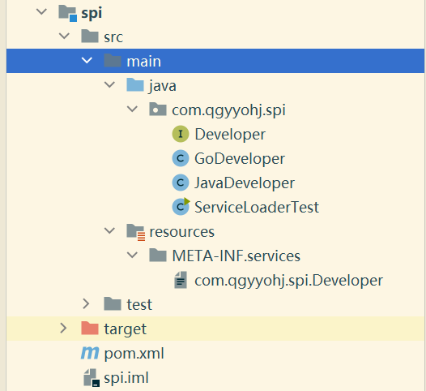

>日常开发中开发的多是API(Application Programming Interface)，定义接口，编定实现类，供调用方调用；
>
>SPI(Service Provider Interface) 是另一种接口，由调用方定义，比如JDBC，接口在`java.sql`包中，通过`Class#forName`将实现类加载到内存中，供调用方使用
>
>这篇文章来记录一个不一定有用但很好玩的接口`java.util.ServiceLoader`

定义一个接口

```java
package com.qgyyohj.spi;

public interface Developer {
    void sayHi();
}

```

两个实现类

```java
package com.qgyyohj.spi;

public class GoDeveloper implements Developer {
    @Override
    public void sayHi() {
        System.out.println("hi, i am a Go developer.");
    }
}

```

```java
package com.qgyyohj.spi;

public class JavaDeveloper implements Developer {
    @Override
    public void sayHi() {
        System.out.println("hi, i am a Java developer.");
    }
}

```

下面是主函数

```java
package com.qgyyohj.spi;

import java.util.ServiceLoader;

public class ServiceLoaderTest {
    public static void main(String[] args) {
        ServiceLoader<Developer> serviceLoader = ServiceLoader.load(Developer.class);
        serviceLoader.forEach(Developer::sayHi);
    }
}

```

这个工作做完后，还需要在`resource`目录下创建一个`META-INF/services`文件夹，里面创建一个文件，文件名为接口的全限定名`com.qgyyohj.spi.Developer`内容是实现类的全限定名

```
com.qgyyohj.spi.GoDeveloper
com.qgyyohj.spi.JavaDeveloper
```

整体结构如下



点击运行

```
hi, i am a Go developer.
hi, i am a Java developer.

Process finished with exit code 0
```

程序中并没有显式调用两个实现类，两个类的方法却被执行了